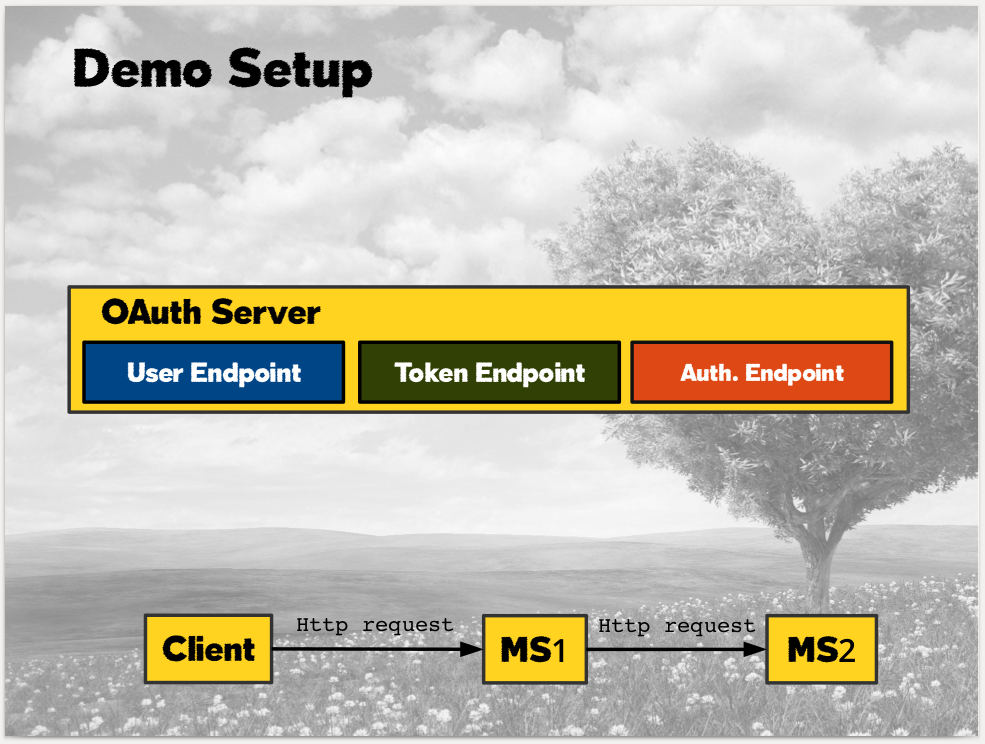

### Preperation
- install maven and java
- clone this repository 
- open your console and switch to the root folder of this sample project (OAUTH_HOME)

### Szenario



### Test OAuth2 Server
To test the OAuth2 Server move to your server home directory and fire up those commands:
```bash
$ cd auth_server
$ mvn clean package
$ cd target
$ java -jar password-flow-0.0.1-SNAPSHOT.jar
```

Wait for the server. Open a new console tab and let's check the OAuth server.
```bash
$ curl acme:acmesecret@localhost:9999/uaa/oauth/token -d grant_type=password -d username=user02 -d password=password
$ {"access_token":"232f6fe0-f117-4a0f-8dd6-9c7a7b5f1cd2","token_type":"bearer","refresh_token":"f9e87b15-f764-47b7-a34a-9665cd4d4967","expires_in":43199,"scope":"openid"}
$ TOKEN=232f6fe0-f117-4a0f-8dd6-9c7a7b5f1cd2
$ curl -H "Authorization: Bearer $TOKEN" localhost:9999/uaa/user
$ {"details":{"remoteAddress":"127.0.0.1","sessionId":null,"tokenValue":"232f6fe0-f117-4a0f-8dd6-9c7a7b5f1cd2","tokenType":"Bearer",.... 
```
### Test Resource Services

To test the first resource service (001), keep the OAuth server running. Open a new console tap, navigate to OAUTH_HOME and start the resource service:

```bash
$ cd resource_server_001
$ mvn clean package
$ cd target
$ java -jar oauth-resource-001-0.0.1-SNAPSHOT.jar
```

Wait for the server and go back to the previous (CURL) tab. The Bearer token still exists, so we simply can call:
```bash
$ curl -H "Authorization: Bearer $TOKEN" -H "Content-Type: application/json" -X POST -d '{"name": "Hans","city": "Munich"}' localhost:8070/hello
$ Fallback Answer: Hello World!
```
Hmmm, perhaps something went wrong. We have start our second resource server. Open a new console tab, move to OAUTH_HOME and enter:

```bash
$ cd resource_server_002
$ mvn clean package
$ cd target
$ java -jar oauth-resource-002-0.0.1-SNAPSHOT.jar
```
Ok. Now the second resource server, or microservice should be up and running. Go back to the previous (CURL) tab. The Bearer token still exists, so we simply can call:

```bash
$ curl -H "Authorization: Bearer $TOKEN" -H "Content-Type: application/json" -X POST -d '{"name": "Hans","city": "Munich"}' localhost:8070/hello
$ Answer for Hans from Munich: Hello user02!
```
Great. We've logged in via OAuth2, called a protected resource and gat a personalized answer back. So the service to service call was not made by technical user, but our infrastructure has downstreamed the token to the next service (to the next security context).

### Verify security settings
To verify, if the security really works as expected, you can call the API without sending the access token:

```bash
$ curl -H "Content-Type: application/json" -X POST -d '{"name": "Hans","city": "Munich"}' localhost:8070/hello
$ {"error":"unauthorized","error_description":"Full authentication is required to access this resource"}
```
Ok. Perhaps the second server (here we've a simple get):
```bash
$ curl localhost:8071/hello
$ {"error":"unauthorized","error_description":"Full authentication is required to access this resource"}
```
So both resources are protected. What's about the method security. We have two users. User 1 (user01) is allowed to call the hello method in service 1, user 2 (user02) is allowed to call the hello method on both services. We've verified, that everthing works fine with user 2. Let's check user 1. First step ist to get a token for this user:

```bash
$ curl acme:acmesecret@localhost:9999/uaa/oauth/token -d grant_type=password -d username=user01 -d password=password
$ {"access_token":"41bcf14c-b45f-4c2f-9cda-4735a1f3ebfe","token_type":"bearer","refresh_token":"c70144b1-caf7-44e2-9b85-d96c080d068c","expires_in":43199,"scope":"read write"}
$ TOKEN=41bcf14c-b45f-4c2f-9cda-4735a1f3ebfe
```

Call the the hello method on our first resource server:
```bash
$ curl -H "Authorization: Bearer $TOKEN" -H "Content-Type: application/json" -X POST -d '{"name": "Hans","city": "Munich"}' localhost:8070/hello
$ Fallback Answer: Hello World!
```
Great. Our setup is still the same: OAuth server and our two resource servers. So why we're getting here a fallback answer? I would suspect, that user 1 is not allowed to call hello on service 2 (you can see this in the logs of service 1). Let's check this:
```bash
$ curl -H "Authorization: Bearer $TOKEN" localhost:8071/hello
$ {"error":"access_denied","error_description":"Zugriff verweigert"}
```
Ok, great. Our authorization and authentication works perfectly in a microservice environment.
